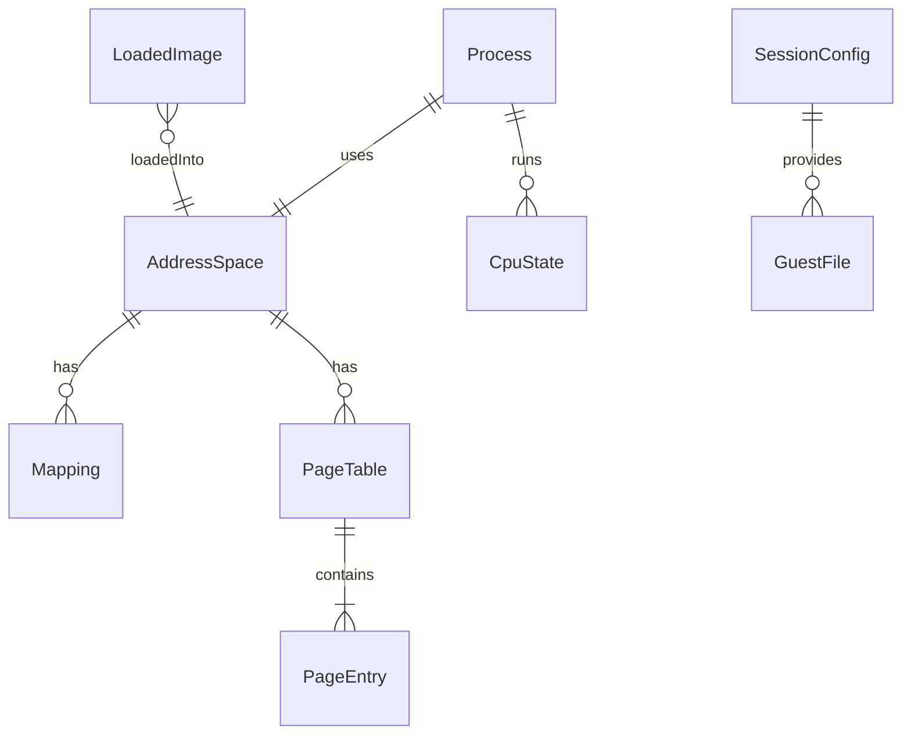

# 振る舞いの仕様（u1-skeleton）

上流の成果物：
- `inception/units-generation/unit-of-work.md`（U1）
- `inception/domain-design/components.md`
- `inception/contract-design/contract-summary.md`
- `inception/requirements-analysis/requirements.md`

データの形は `entities.md`、ルールは `rules.md` が正です。この文書は、手順と状態の移り変わりについての正です。

## 目的

ネイティブの Linux で、C と Rust の static-musl の hello world を最初から最後まで動かし、ネイティブと同じ結果になることを示します（Q1）。あわせて、wasm でスレッドを使えるかを確かめます（Q3）。

## 手順

### W1 コマンドでの実行

1. Cli が `paludarium [options] <program> [args...]` を受け取る（取り決め C11）
2. Cli がオプションを解釈する。`--env KEY=VALUE` は環境変数に足す。知らないオプション・U1 では未実装の `--mount`・プログラムの指定がない場合は、使い方を出して 2 で終わる（BR5.3）
3. Cli が `<program>` をホストのファイルとして読み、GuestFile としてゲストの `/<ファイル名>` に置く。SessionConfig の programPath にはそのパスを、argv[0] には指定した文字列を入れる（BR5.4）
4. Cli が Runtime の Session を作って実行する（W2〜W4）
5. Cli が終了状態を終了コードに変える（BR5.2）
   - ゲストが終わった場合：その終了コード
   - シグナルで終わった場合：128 + シグナル番号
   - エミュレータのエラーの場合：標準エラーに詳細を出し、70 で終わる

### W2 読み込み

1. Runtime が GuestFile を Vfs に置く
2. Loader が Vfs から ELF を読み、受け入れ条件を確かめる（BR1.1）
3. Loader が読み込みの基準アドレスを決める。ET_EXEC なら 0、ET_DYN なら 0x555555554000（BR1.4）
4. Loader が Mmu の新しい AddressSpace に PT_LOAD のセグメントを置く（BR1.2）
5. Loader がスタックの Mapping を作り、引数・環境変数・補助ベクタを積む。AT_RANDOM の値は Host の乱数から取る（BR1.3）
6. Kernel が Process と、最初のスレッドの CpuState を作る。CpuState には次の値を入れる
   - 命令ポインタ：入口
   - スタックポインタ：最初のスタック
   - break：初期値

### W3 実行ループ（スレッドごと。U1 では 1 つ）

1. Runtime が CpuState と AddressSpace を Cpu に渡し、予算の分だけ実行させる（BR4.3）
2. Cpu が止まったら、理由ごとに処理する
   - syscall：Kernel に渡す（W4）
   - page-fault：プロセスは SIGSEGV で終わる（BR2.2）。U1 ではシグナルを配送しないので、ゲストがハンドラを登録していても呼ばない（BR4.5）
   - invalid-opcode：プロセスは SIGILL で終わる（BR4.1、BR4.5）
   - halt：特権命令なので、ゲストへの SIGSEGV として扱い、プロセスは終わる（Linux のユーザーモードと同じ）
   - budget-exhausted：止める要求（kill）がなければ 1 に戻る。要求があれば、プロセスを SIGKILL で終わらせる（BR4.3）
3. Kernel の答えで、次の動きを決める
   - Resume：1 に戻る
   - Exit：終了状態を返す

### W4 syscall

1. Kernel が rax の番号を表で引く（BR3.1）
2. 表にない番号には -ENOSYS を返す（BR3.2）
3. 表にあれば引数を検査し、Mmu からゲストのメモリを読み書きし、必要なら Host を呼ぶ（BR3.3、BR3.4、BR6.1）
4. 戻り値を rax に入れて Resume を返す。exit・exit_group なら Exit を返す（BR5.1）

### W5 差分テスト（CI）

1. CI が C の hello world を musl で、Rust の hello world を x86_64-unknown-linux-musl でビルドする（BR7.2）
2. x86-64 Linux のランナーで、ゲストを直接動かし、標準出力・標準エラー・終了状態を記録する
3. 同じゲストをエミュレータで動かし、同じものを記録する
4. 2 と 3 がバイト単位で一致すれば合格（BR7.1）

### W6 wasm のスレッドの確認

1. 確認用の小さなプログラムを wasm にビルドする。このプログラムは Host の trait を通さない単独のもので、Host の wasm 用の設計の材料にする。その際、Rust の nightly でスレッドに要る設定を記録する（BR8.1、BR8.2）
   - ブラウザでは、COOP/COEP の見出しを付けて配る小さな配信の仕組みでページを開く
2. SharedArrayBuffer を共有した Worker を 2 つ作る
3. Worker A が、共有メモリのアドレスで値の変化を待つ
4. Worker B が値を書いて A を起こす
5. A が 5 秒以内に正しい値で起きれば合格（BR8.1）
6. これを Node.js・Chromium 系・Firefox・Safari で行い、環境ごとに WasmThreadReport を作る
7. 報告には次の 2 つを書く（BR8.2）
   - Worker を作るのは、Host の wasm 用の実装と起動用 JS のどちらが妥当か
   - その理由
8. 不合格の環境があっても、U1 は報告をもって完了できる。ただし、U4・U5 に入る前に設計を見直す（BR8.1）

### W7 U1 の命令の決め方

1. CI でビルドした C と Rust の hello world を逆アセンブルし、実行される命令の一覧を作る（BR4.4）
2. 一覧の命令（出てくる SSE 系の命令を含む）を、コード生成の計画に書く
3. 命令ごとに差分テストを用意してから実装する（team-practices の Testing Posture）

## 状態の移り変わり

### プロセス

| 今の状態 | 出来事 | 条件 | 次の状態 | すること |
|----------|--------|------|----------|----------|
| Loading | 読み込みの成功 | BR1.1〜BR1.3 を満たす | Running | 最初のスレッドを作る |
| Loading | 読み込みの失敗 | どれかを満たさない | Failed | エミュレータのエラーを返す（終了コード 70） |
| Running | exit・exit_group | — | Exited | 終了状態を記録する（BR5.1） |
| Running | フォールト・未対応の命令・halt | U1 ではシグナルを配送しない（BR4.5） | Signaled | 終了状態をシグナルで記録する |
| Running | kill の要求 | 予算の区切りで確かめる（BR4.3） | Signaled | 終了状態を SIGKILL で記録する |
| Running | エミュレータのエラー | 内部の矛盾など | Failed | エラーを返す（終了コード 70） |

Exited・Signaled・Failed が終わりの状態です。

### スレッド

| 今の状態 | 出来事 | 次の状態 |
|----------|--------|----------|
| Runnable | 実行ループが Cpu に渡す | Running |
| Running | syscall で止まる | InSyscall |
| Running | 予算を使い切る | Runnable |
| InSyscall | Kernel が Resume を返す | Runnable |
| InSyscall | Kernel が Exit を返す | Exited |
| Running | フォールト・未対応の命令・halt で止まる | Exited（プロセスがシグナルで終わる） |
| Runnable | kill の要求 | Exited（プロセスが SIGKILL で終わる） |

## データの関係（entities.md から作った図）

## ルールの要約（rules.md から作った表）

| 分類 | ルール |
|------|--------|
| 読み込み | BR1.1 受け入れ条件、BR1.2 セグメントの配置、BR1.3 最初のスタック、BR1.4 static-pie の基準アドレス |
| メモリ | BR2.1 2 段のページテーブル、BR2.2 フォールト、BR2.3 brk |
| syscall | BR3.1 振り分け、BR3.2 未実装は ENOSYS、BR3.3 U1 の syscall、BR3.4 write の範囲 |
| 命令 | BR4.1 実行と未対応、BR4.2 syscall 命令、BR4.3 予算と kill、BR4.4 U1 の命令の決め方、BR4.5 シグナルは登録だけ |
| 終わり方 | BR5.1 終了コード、BR5.2 コマンドの終了コード、BR5.3 引数の誤り、BR5.4 <program> の置き場所 |
| ホスト | BR6.1 Host の trait だけを通す |
| 検証 | BR7.1〜BR7.2 差分テスト、BR8.1〜BR8.2 wasm の確認、BR9.1 ファジング |

## Assumptions & Open Questions

None.
