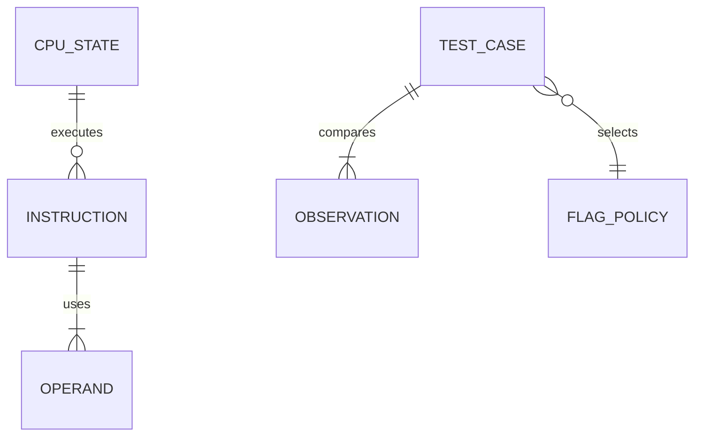

# U2：整数命令とフラグの機能仕様

## Sources

- 要件書 FR1.3（整数命令とフラグ）、FR1.6（未対応命令の SIGILL）、FR9.1（差分テスト）、NFR1・NFR2。
- Unit U2 とその要件対応表、部品 Cpu/Decoder/Mmu/Kernel/Runtime/Harness、契約 C1・C3・C4・C5。
- `functional-design-questions.md` Q1 と `[Answer]: Looks correct` で確認された要約。

本書は順序と状態遷移の正本。データの正本は `entities.md`、判断規則の正本は `rules.md`。以下は設計の要求であり、実装の動作は未検証。

## Scope

probe と aube が使う整数命令の意味論をそろえる。U1 の hello world と既存命令の動作を維持する。SSE の追加は U3、ゲストのスレッド作成と futex は U5、probe/aube 全体の合格は U10。

対象命令の完全な一覧が未取得なので、U2 のコード生成計画で対象版・取得したバイナリ・命令一覧の取得方法を記録する。静的走査は到達性や全入力経路の保証には使わない。実行時の未対応命令も一覧へ加える。取得できない部分は未検証として残し、probe/aube の全量対応を宣言しない。

整数命令の分類は、転送・拡張、算術・論理、比較・条件分岐、shift/rotate、stack/call/return、string と反復、bit 操作、原子的な read-modify-write。追加する各形式は幅・prefix・暗黙のレジスタ・アドレス方式まで記録する。原子操作は U2 の必須の実装範囲（Q1）。lock が有効な read-modify-write、メモリ xchg、cmpxchg 系を単なる read/write に分解しない。

## Ownership and Contract Changes

| 境界 | U2 の責任 | 既存の所有・後続の責任 |
|---|---|---|
| C1 停止理由 | 除算例外など必要な停止理由の追加。全 consumer を同じ変更で更新 | ゲストの停止とエミュレータの Error は別型 |
| C3 Decoder | 幅・prefix・オペランド形式の情報を Cpu に渡す | 外部 crate の型を隠す既存方針を維持 |
| C4 Mmu | 原子的な交換・比較交換・更新の契約と全アクセス共通の同期を追加 | mapping と権限は Mmu。メモリ syscall の拡充は U4 |
| C5 Cpu | 命令の意味論と faulting state、実行予算と再開の契約を実装 | CpuState は Kernel.Thread 所有。Cpu は Kernel を呼ばない |
| Runtime → Kernel | InvalidOpcode は SIGILL、PageFault は SIGSEGV、除算例外は SIGFPE の既定終了へ渡す | シグナル登録・マスク・handler 配送の拡充は U4 |
| Harness | 命令形式のマトリクス、条件別 flag policy、native 観測とホスト並行検証 | ゲスト clone/futex の統合は U5 |

Mmu の原子操作は「幅・アドレス・入力・更新方式」を受け取り、旧値と比較成功の有無、または fault を返す。任意の外部 callback を排他区間で呼ばない。Cpu は Mmu が返した旧値から、形式に応じたレジスタ・フラグの結果を確定する。Mmu は Kernel や Cpu に依存しない。

初期の同期はアドレス空間単位で直列化する方式を選べる。read/write/fetch と原子操作、mapping の変更が同じ同期規約へ参加する。単なる byte 単位の原子 load/store の列を、複数 byte の不可分な更新と見なさない。公開操作から公開操作を再入呼び出しせず、排他中は内部の操作を使う。順序モデルは逐次一貫の直列化を下限とし、lock 命令の必要な前後の順序を弱めない。

cmpxchg8b/16b の形式は対応表で独立に管理する。128-bit はレジスタ対として扱い、SSE の対応を意味しない。形式固有の整列違反は Cpu のゲスト例外として返す。一般的な非整列・ページ跨ぎの原子操作は全範囲を検査して一括で更新する。比較失敗でもメモリ宛て命令が要求する write 権限を検査する。

## Workflows

### 通常の整数命令

1. Runtime が Thread の CpuState と AddressSpace、実行予算を Cpu に渡す。
2. Cpu が現在の RIP から必要な bytes を fetch し、Decoder で形式を判定する。不要な先読みで正常命令を fault にしない。
3. 対応表で形式・prefix の合法性を確かめる。不正・未実装は InvalidOpcode で止まる。
4. 部分レジスタ・即値・実効アドレスを解決する。lea はメモリを読み取らない。
5. 必要な読み取りと全書き込み先の検査を行い、計算結果を用意する。除算は商の範囲まで検査する。
6. 非反復の命令は成功した場合だけ、メモリ・レジスタ・フラグ・次 RIP を確定する。失敗なら命令開始時の可視状態と RIP を保持する。
7. 予算が残れば次の命令へ進み、なければ現在の確定状態を Runtime に返す。

### 原子的な整数命令

1. Cpu が有効な lock 形式、またはメモリ xchg の暗黙の原子性を判定する。レジスタだけの xchg と混ぜない。
2. Cpu が幅・アドレス・入力を決め、Mmu の単一の更新操作へ渡す。
3. Mmu が通常アクセス・mapping 操作と共通の排他を取得する。
4. 全範囲の有効性と必要な権限を検査する。失敗ならメモリ更新なしで返す。
5. 同じ排他区間で旧値を読み、比較または計算し、必要な値を書き込む。成功・失敗とも一つの線形化点を持つ。
6. 実行可能なページへの書き込みを含め、既存のコード世代更新を行う。比較失敗などの非変更でも、命令が要求する write 検査は省かない。
7. Mmu が結果を返し、Cpu がレジスタ・定義済みフラグ・RIP を確定する。Mmu の fault ならそれらを確定しない。

### 反復と中断

1. Cpu が有効な反復 count と方向を解決する。count がゼロなら不要なメモリアクセスをせず完了する。最初の実行時に repeatContinuation に開始 RIP・命令識別・開始時 rflags を保存する。同じ命令を内部 BudgetStop から再開する場合は、この開始時値を取り直さない。
2. 一反復の全アクセスを検査し、一反復を実行する。
3. 成功した分の index・count・必要なフラグを更新する。
4. 条件成立なら反復を終了し次 RIP に進む。継続中なら同じ RIP を維持する。
5. fault では未完了反復の更新を取り消し、完了した count/index と faulting RIP を保持する。MOVS/STOS 等と異なり、REPE/REPNE CMPS/SCAS では rflags を repeatContinuation の命令開始時値へ復元してから返す。内部予算切れでは復元せず、現時点の flags・残りの count・開始時 flags を保存し、同じ命令を再開する。正常完了・fault・別命令への移行では継続情報を破棄する。

ドキュメント根拠：[Intel SDM、REP/REPE/REPZ/REPNE/REPNZ](https://cdrdv2-public.intel.com/819710/252046-sdm-change-document.pdf) は、REPE/REPNE CMPS/SCAS の fault 時に命令開始前の EFLAGS を復元する特例を定義する。実装と native の例外時観測は未検証。

### 差分テスト

1. 実装前にケースの対象 bytes・初期レジスタ・初期フラグ・メモリと権限・観測範囲を用意する。
2. native-linux-x86_64 の独立した子プロセスで同じケースを実行し、成功時のレジスタ・flags・メモリ、異常時のシグナルと例外時レジスタ・flags を観測する。反復比較の fault は signal context から faulting RIP・count/index・flags を取得し、シグナル番号だけで合格にしない。
3. エミュレータでも同じ入力を実行する。観測器の失敗・時間切れ・ゲスト終了を区別する。
4. 定義済み flags とレジスタ・メモリ・停止種別を比較し、保持 flags は実行前の値も検査する。未定義の値だけを条件別 policy で除外する。
5. 不一致はケース ID、形式、幅、初期値、raw の native/emulator 出力、比較マスクと差分を報告する。期待結果を固定 baseline に置き換えない。
6. 原子性は別に、複数ホストスレッドが同じ AddressSpace を共有して競合更新する検証で確かめる。合計値・比較交換成功回数・旧値の一意性、通常アクセスが途中を見ないこと、ページ跨ぎを検査する。全ケースに有限の時間切れを付ける。

## State Transitions

| 現在 | 条件 | 次状態 | 可視状態 |
|---|---|---|---|
| Ready | fetch/decode/検査が通る | Executing | 命令開始状態 |
| Executing | 非反復命令の成功 | Ready または BudgetStop | 結果と次 RIP を確定 |
| Executing | 一反復成功、残りあり | Repeating | 完了分の count/index、同じ RIP |
| Repeating | 終了条件成立 | Ready | 次 RIP |
| Ready/Executing | 不正・未対応 | InvalidOpcode → SIGILL | faulting RIP、未完了結果なし |
| Ready/Executing/Repeating | memory fault | PageFault → SIGSEGV | faulting RIP、反復の完了分 count/index。REPE/REPNE CMPS/SCAS は開始時 flags を復元。継続情報を破棄 |
| Executing | 除算例外 | ArithmeticFault → SIGFPE | faulting RIP、商・剰余未確定 |
| Ready/Repeating | 予算切れ | BudgetStop → 再開 | 最後の確定状態。反復中は開始時 flags を含む継続情報を維持 |

ゲストのシグナル handler 配送は U4 の範囲。U2 では既定のシグナル終了と Cpu の停止理由を扱う。

## Derived Entity Relationships

テキスト表現：CpuState は複数の Instruction を実行し、Instruction は Operand を使う。TestCase は複数の Observation を比較し、一つの FlagPolicy を選ぶ。これは `entities.md` の関係から導いた表示であり、永続ストレージの構造ではない。

## Derived Rules Summary

| まとまり | 規則 | 検証する内容 |
|---|---|---|
| 整数意味論 | BR1.1〜BR1.7 | 形式と幅、部分レジスタ、フラグ、アドレス、fault、反復、除算 |
| 原子操作 | BR2.1〜BR2.5 | 共通排他、全範囲の検査、比較失敗、競合と担当 |
| 停止 | BR3.1〜BR3.2 | SIGILL と fetch の fault の区別 |
| 観測 | BR4.1〜BR4.2 | 実行ごとの native 値と意味論の検証軸 |

## Acceptance Scenarios

- 同じ形式の 8/16/32/64-bit、符号境界・ゼロ・carry/borrow・overflow の差分ケースで、結果と比較対象 flags が一致する。
- 同じ親レジスタへの低位/高位 byte・16-bit・32-bit 書き込みと prefix の組み合わせが一致する。
- shift/rotate のゼロ・1・幅付近・マスク前の大きな count と、方向フラグを変えた反復の結果が一致する。
- REPE CMPS と REPNE SCAS は、開始時 flags と成功比較後 flags が異なる入力で、成功反復後に次ページを fault させる。native の例外時 RIP・count/index・flags と一致する。エミュレータ側に内部 BudgetStop を挟んだ同一ケースも同じ native 結果と比較し、開始時 flags の取り直しを検出する。fault の観測方法自体の失敗はテスト不成立として扱う。
- cmpxchg の成功・失敗、xchg と lock 更新の競合、通常アクセスとの重なり、ページ跨ぎ、read-only 宛先で不可分性と fault の結果を検査する。
- 不正 bytes・UD2・不正 lock・未実装形式でゲスト SIGILL が返り、エミュレータが panic しない。命令 fetch のページ境界のケースは SIGSEGV と区別する。
- div/idiv のゼロ除数・商の範囲外で SIGFPE、正常時は商・剰余が一致する。
- U1 の C/Rust hello world と既存の差分ケースが引き続き通る。

## Assumptions & Open Questions

- probe/aube の完全な命令一覧は未取得。コード生成で版と抽出証拠を記録するまでは実プログラムの全量対応は未検証。
- wasm の共有 heap に対する原子操作の実装は U11 で確認する。本書の不可分性・全アクセス共通の同期契約を保つ。
- 命令・入力条件別の flags の詳細表はコード生成で仕様根拠と native 観測を付けて作る。未定義の範囲を推測で広げない。
