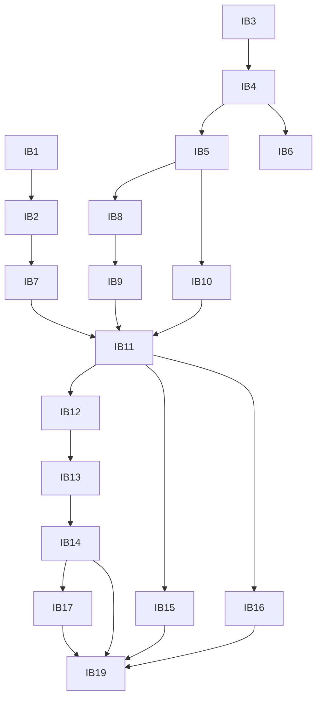

# 意図のバックログ：Rust 版 blink（paludarium）

上流の成果物：
- `ideation/intent-capture/intent-statement.md`
- `ideation/feasibility/feasibility-assessment.md`
- `ideation/feasibility/constraint-register.md`

根拠は `scope-definition-questions.md` の回答（Q1〜Q6）と `scope-document.md` です。

## 優先順位の付け方

- 優先度は MoSCoW で付けました。
- このワークフローの成功条件（意図書と Q3・Q4・Q6）に入っている項目は、どれも Must です。そのため、Must の中での優先順位は「段階の順番」（Q1：番号の順）で決めます。
- Won't は Q5 で選んだ 2 項目です。

## バックログ

各項目は、後の工程で作業単位（Unit）に分けるときの元になります。

| ID | 項目 | 優先度 | 段階 | 依存 | 根拠 |
|----|------|--------|------|------|------|
| IB1 | 命令デコーダ（自作。x86-64、SSE 系まで） | Must | 1 | なし | 実現性 Q9、Q5 |
| IB2 | 整数命令とフラグの実行 | Must | 1 | IB1 | 意図書 |
| IB3 | ソフトウェア MMU と、メモリ確保の syscall（mmap・brk など） | Must | 1 | なし | 制約 C-T10 |
| IB4 | static-musl の ELF の読み込みとプロセスの起動 | Must | 1 | IB3 | 制約 C-T4 |
| IB5 | 基本の syscall（出力・終了・時刻など）。hello world に必要な範囲 | Must | 1 | IB4 | Q2 |
| IB6 | ネイティブの x86-64 Linux との差分テストの仕組み | Must | 1 | IB4 | RAID ログ R1 |
| IB7 | SSE 系の命令の実行（tokio・rayon・aube が使う範囲） | Must | 2 | IB1、IB2 | 意図書（Q4） |
| IB8 | スレッドと同期（clone、futex、FUTEX_WAIT_BITSET） | Must | 2 | IB5 | 意図書（Q4） |
| IB9 | イベントとソケット（eventfd2、ホストに頼らない edge-triggered epoll、socketpair、タイマー） | Must | 2 | IB8 | 意図書（Q4） |
| IB10 | ファイルシステム（既定は仮想、ホストを見せる方式も選べる。作成、hard link、symlink、flock、rename、read_dir） | Must | 2 | IB5 | 実現性 Q6、意図書 |
| IB11 | ネイティブの Linux で probe と aube を動かす | Must | 2 | IB7〜IB10 | 意図書、Q3 |
| IB12 | wasm ビルド（ゲストのスレッドを Worker に割り当てる） | Must | 3 | IB11 | 制約 C-T5、C-T11 |
| IB13 | 起動用 JS と、Node.js・ブラウザ用のテストハーネス | Must | 3 | IB12 | 制約 C-T6 |
| IB14 | Node.js の Worker、Chromium 系・Firefox・Safari で probe と aube を動かす | Must | 3 | IB13 | Q3、Q4 |
| IB15 | macOS のホスト対応 | Must | 4 | IB11 | 制約 C-T7 |
| IB16 | Windows のホスト対応 | Must | 4 | IB11 | 制約 C-T7 |
| IB17 | wasm 向け JIT の最小版と、Node.js の Worker での速さの比較 | Must | 5 | IB14 | 意図書（Q9・Q10）、実現性 Q7 |
| IB18 | CI（GitHub。必要ならクラウドの実行環境） | Must | 1 から順に拡張 | なし | 制約 C-E1 |
| IB19 | crates.io と npm へのパッケージ公開 | Must | 公開 | IB11〜IB17 | Q6 |
| IB20 | ネイティブ向けの JIT | 後で考える | — | — | 意図書（Q9） |
| IB21 | 動的リンクのバイナリ（glibc の共有ライブラリ） | 決めていない（成功条件の外） | — | — | Q5（選ばれなかった） |
| IB22 | 32-bit x86 のゲスト | Won't | — | — | Q5 |
| IB23 | AVX・AVX-512 の命令 | Won't | — | — | Q5 |

## 依存の流れ

文字での説明：
- デコーダ（IB1）、MMU（IB3）、ELF の読み込み（IB4）、基本の syscall（IB5）が土台です。
- その上にスレッド（IB8）、イベント（IB9）、ファイルシステム（IB10）、SSE（IB7）を作り、ネイティブの Linux で probe と aube を動かします（IB11）。
- IB11 の後に、wasm（IB12〜IB14）と macOS・Windows（IB15・IB16）に分かれます。
- JIT（IB17）は wasm の後です。
- 公開（IB19）は、すべてがそろってからです。

## Assumptions & Open Questions

- [assumption] aube は static-musl の x86-64 向けにビルドできる（IB11 の前提）。
- [assumption] Safari は、Worker と SharedArrayBuffer を使ったマルチスレッドに十分対応している（IB14 の前提）。
