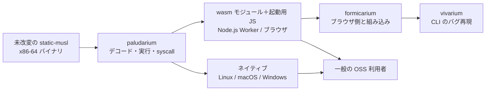

# 範囲の文書：Rust 版 blink（paludarium）

上流の成果物：
- `ideation/intent-capture/intent-statement.md`（意図書）
- `ideation/feasibility/feasibility-assessment.md`（実現性の評価）
- `ideation/feasibility/constraint-register.md`（制約の一覧）

根拠は `scope-definition-questions.md` の回答（Q1〜Q6）です。

## このワークフローの目標

jart/blink と同等の x86-64 ユーザーモード Linux エミュレータを、Rust で一から作ります（意図書、制約 C-T1〜C-T3）。

次のすべてを満たしたら完了です。

1. formicarium の probe（tokio・rayon・ファイル操作）と aube が、ネイティブの Linux・macOS・Windows で動く（意図書 Success Metrics、Q3、制約 C-T7）
2. 同じ probe と aube が、wasm モジュール 1 つ＋起動用 JS として、Node.js の Worker とブラウザ（Chromium 系・Firefox・Safari）で動く（意図書、Q3、Q4）
3. wasm 向けの JIT を有効にしても probe が全項目通り、Node.js の Worker で JIT なしより速い（意図書 Q10、実現性 Q7）
4. 上の 1〜3 を満たしたら、crates.io や npm にパッケージを公開する（Q6）

## 範囲に含むもの（In）

| 領域 | 内容 | 根拠 |
|------|------|------|
| 命令デコーダ | x86-64 の命令を自作のデコーダで解釈する。SSE 系までを対象にする | 実現性 Q9、Q5 |
| 命令の実行 | 整数命令、フラグ、SSE 系の命令の意味論を実装する | 意図書、実現性の評価 |
| メモリ | ソフトウェア MMU でゲストの 64-bit アドレス空間を扱う | 制約 C-T10 |
| プログラムの読み込み | static-musl の x86-64 ELF を読み込んで起動する | 制約 C-T4 |
| Linux の syscall | probe と aube に必要な範囲。eventfd2、FUTEX_WAIT_BITSET、ホストに頼らない edge-triggered epoll、socketpair を含む | 意図書（Q4） |
| スレッド | ゲストのスレッドを、ホストのスレッドや Worker に割り当てる | 実現性の評価 |
| ファイルシステム | 既定は仮想ファイルシステム。ホストのファイルシステムをそのまま見せる方式も選べる。作成、hard link、symlink、flock、rename、read_dir に対応する | 実現性 Q6、制約 C-T8 |
| ホスト | ネイティブの Linux・macOS・Windows、wasm（Node.js の Worker とブラウザ） | 制約 C-T7、Q4 |
| wasm の周辺 | 最小限の起動用 JS と、Node.js・ブラウザ用のテストハーネス | 制約 C-T6 |
| JIT | wasm 向けの最小版 | 意図書（Q9） |
| 検証 | ネイティブの x86-64 Linux との差分テスト。CI は GitHub（必要ならクラウドも） | RAID ログ R1、制約 C-E1 |
| 公開 | crates.io と npm へのパッケージ公開 | Q6 |

## 範囲に含めないもの（Out）

| 項目 | 扱い | 根拠 |
|------|------|------|
| 32-bit x86 のゲスト | Won't（このワークフローでは作らない） | Q5 |
| AVX・AVX-512 の命令 | Won't（SSE 系までにする） | Q5 |
| ブラウザ側の本番実装（Worker・ページ・ファイルシステム）と formicarium への組み込み | formicarium が担う | 意図書 Initial Scope Signal、制約 C-O3 |
| ネイティブ向けの JIT | このワークフローでは作らない。意図書どおり「後で考える」 | 意図書（Q9） |
| 動的リンクのバイナリ（glibc の共有ライブラリ） | 成功条件に含めない。範囲外とも決めていない | Q5（選ばれなかった） |
| 他のプロジェクトのコードの取り込み、外部の部品の利用 | しない | 制約 C-T2、C-T3 |

## 段階と順番

段階は番号の順（1 → 2 → 3 → 4 → 5）に進め、土台から積み上げます（Q1）。最初の区切りは段階 1 の完了です。そこで設計の進め方を見直します（Q2）。

| 段階 | 完了の条件 | 実現性の評価での見積もり |
|------|------------|--------------------------|
| 1 | ネイティブの Linux で static-musl の hello world が動く（最初の区切り） | 2〜4 か月 |
| 2 | ネイティブの Linux で probe と aube が動く | 3〜6 か月 |
| 3 | Node.js の Worker と 3 種類のブラウザで probe と aube が動く | 2〜4 か月 |
| 4 | macOS と Windows のホストで probe と aube が動く | 2〜5 か月 |
| 5 | wasm 向け JIT の最小版。Node.js の Worker で JIT なしより速い | 1〜2 か月以上 |
| 公開 | crates.io と npm にパッケージを公開する | 見積もりなし |

見積もりは判断によるもので、精度は低いです。段階 1 の実績で見直します（RAID ログ A4）。

## 価値の流れ

文字での説明：
1. 未改変のバイナリを、paludarium がデコード・実行し、syscall に応えます。
2. その結果はネイティブのホストか、wasm モジュールとして動きます。
3. wasm モジュールは formicarium がブラウザに組み込み、vivarium が CLI のバグ再現に使います。
4. 一般の OSS 利用者は、ネイティブ版と wasm 版のどちらも使えます。

## 範囲と期限の整合

- **期限との関係**
  - 期限はありません（意図書 Initiative Trigger）。
  - Q3 で aube を、Q4 で Safari を合格条件に加えたので、範囲は意図書の時点より広がりました。
  - 期限がないので、時期と範囲が矛盾することはありません。
- **リスク**
  - 範囲が広いので、一人の開発では長期化して止まるリスクがあります（RAID ログ R4）。
  - 段階ごとに動くものを出すことで、このリスクを抑えます。
- **残るリスク**
  - Q1 では、wasm のマルチスレッドの試作を先にする順番は選ばれませんでした。
  - このため、wasm でスレッドが作れないリスク（RAID ログ R2）に気づくのは段階 3 になります。
  - 段階 1 の設計で、wasm への移しやすさを意識しておく必要があります。

## Assumptions & Open Questions

- [assumption] aube は static-musl の x86-64 向けにビルドできる。背景資料で確かめられているのは i586 glibc のビルドだけ。段階 2 の前に確かめる。
- [assumption] Safari は、Worker と SharedArrayBuffer を使ったマルチスレッドに十分対応している。段階 3 の前に確かめる。
- [assumption] 「外部の部品を使わない」には、ビルドやテストの道具を含めない（RAID ログ A1）。要件分析で確かめる。
