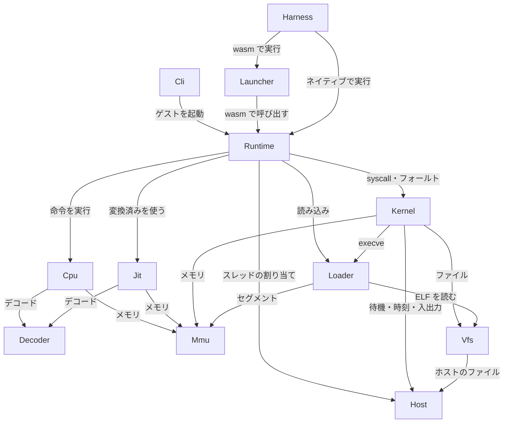

# 部品の一覧：Rust 版 blink（paludarium）

上流の成果物：
- `inception/requirements-analysis/requirements.md`（要件書。FR・NFR の ID はそのまま使う）
- `inception/practices-discovery/team-practices.md`（Code Style の層の分け方）

根拠は `domain-design-questions.md` の回答（Q1〜Q6）です。設計判断の詳細は `decisions.md` の ADR にあります。

この工程では、部品（自分たちで書くコード）とその責任・依存・持つデータを決めます。どの部品をどのクレートにまとめるか（配置）は、次の Units Generation で決めます。

## 部品の一覧（機械向け）

```yaml
components:
  - name: Decoder
    summary: x86-64 の機械語を、実行に使える命令の表現に変換する
    behaviour: >
      既存のデコーダの crate（iced-x86 など）を包み、他の部品にはこの部品の型だけを見せる。
      対象は x86-64 の命令で SSE 系まで。AVX・AVX-512 と範囲外の命令は「未対応」として返し、panic しない。
      crate に不具合や合わないところがあれば、その部分だけを自作に置き換える（project.md の Mandated）。
    responsibilities:
      - 命令のバイト列を命令・オペランド・長さに変換する
      - 未対応・不正な命令を判別して返す
    depends_on: []
    dependents:
      - component: Cpu
        interaction: 実行する命令をデコードする
      - component: Jit
        interaction: wasm に変換する命令列をデコードする
    external_dependencies:
      - name: iced-x86（などの既存のデコーダの crate）
        kind: other
        purpose: 命令のデコード
    entities:
      - name: DecodedInstruction
        identifier: guestRip
        attributes: [guestRip, length, mnemonic, operands, encodingBytes]

  - name: Mmu
    summary: ゲストの 64-bit アドレス空間と、読み書き・実行の権限を管理する
    behaviour: >
      ゲストのアドレスを型（GuestAddr）でホストのアドレスと区別し、ソフトウェアのページテーブルで対応させる。
      wasm32 でもネイティブでも同じに動く。範囲外・権限違反のアクセスは、ゲストへのページフォールトとして返す。
      ホストの資源の上限は設けない（NFR5）。
    responsibilities:
      - アドレス空間の作成・複製・破棄
      - 領域の割り当て・解放・権限の変更（mmap・munmap・mprotect・brk の実体）
      - ゲストのメモリの読み書きと、フォールトの判定
    depends_on: []
    dependents:
      - component: Cpu
        interaction: 命令の取り出しとオペランドの読み書き
      - component: Loader
        interaction: ELF のセグメントと最初のスタックを置く
      - component: Kernel
        interaction: syscall の引数のメモリを読み書きし、メモリの syscall を実行する
      - component: Jit
        interaction: 変換したコードからのメモリアクセスと、書き換えられたページの検出
    entities:
      - name: AddressSpace
        identifier: addressSpaceId
        attributes: [addressSpaceId, mappings, programBreak]
      - name: Mapping
        identifier: start
        attributes: [start, length, protection, backing]

  - name: Cpu
    summary: スレッドのレジスタ状態を受け取り、命令を実行する（インタプリタ）
    behaviour: >
      整数命令・フラグ・SSE 系の命令の意味論を実装する。syscall 命令・フォールト・未対応の命令に出会うと、
      止まった理由を返して止まる。Kernel を知らない（Q4）。
      レジスタの状態は自分では持たず、呼び出し側から渡される（Q2）。
    responsibilities:
      - 命令の意味論（整数・フラグ・SSE 系）
      - 止まった理由（syscall・フォールト・未対応の命令）を返す
    depends_on:
      - component: Decoder
        interaction: 命令をデコードする
        style: sync
      - component: Mmu
        interaction: 命令とオペランドのメモリを読み書きする
        style: sync
    dependents:
      - component: Runtime
        interaction: 実行ループが命令を実行させる
    entities:
      - name: ExitReason
        identifier: kind
        attributes: [kind, guestRip, faultAddress, syscallNumber]

  - name: Vfs
    summary: 仮想ファイルシステムと、ホストのディレクトリを見せる仕組み
    behaviour: >
      既定はエミュレータの中だけのファイルシステム。選んだときだけ、ホストの指定ディレクトリを見せる。
      パスの解決では、.. やシンボリックリンクで指定ディレクトリの外へ出られないようにする（project.md の Mandated）。
      作成・読み書き・hard link・symlink・flock・rename・read_dir・stat 系に対応する。
    responsibilities:
      - パスの解決と、ディレクトリの外へ出ないことの保証
      - ファイル・ディレクトリ・リンクの操作
      - flock の管理
      - 起動前のファイルの配置
    depends_on:
      - component: Host
        interaction: ホストのディレクトリを見せる方式で、ホストのファイルを読み書きする
        style: sync
    dependents:
      - component: Loader
        interaction: ELF のファイルを読む
      - component: Kernel
        interaction: ファイルの syscall を実行する
    entities:
      - name: Inode
        identifier: inodeNumber
        attributes: [inodeNumber, kind, mode, size, linkCount, contentOrTarget]
      - name: Mount
        identifier: mountPoint
        attributes: [mountPoint, kind, hostRoot]
      - name: FileLock
        identifier: inodeNumber
        attributes: [inodeNumber, mode, holders]
        references:
          - entity: Inode
            owned_by: Vfs
            relationship: 各ロックは 1 つの Inode に付く

  - name: Loader
    summary: static-musl の ELF を読み込み、起動の準備をする
    behaviour: >
      ELF の形式を検査し、セグメントをアドレス空間に置く。引数・環境変数・補助ベクタを最初のスタックに積む。
      不正な ELF ではエラーを返し、panic しない（NFR2）。
    responsibilities:
      - ELF の検査と読み込み
      - 最初のスタックと補助ベクタの作成
    depends_on:
      - component: Mmu
        interaction: セグメントとスタックを置く
        style: sync
      - component: Vfs
        interaction: ELF のファイルを読む
        style: sync
    dependents:
      - component: Kernel
        interaction: execve でプログラムを読み込む
      - component: Runtime
        interaction: 最初のプログラムを読み込む
    entities:
      - name: LoadedImage
        identifier: entryPoint
        attributes: [entryPoint, segments, auxiliaryVector, initialStackPointer]
        references:
          - entity: AddressSpace
            owned_by: Mmu
            relationship: 読み込み先の 1 つのアドレス空間

  - name: Kernel
    summary: Linux の syscall を受け付け、プロセス・スレッド・ファイル記述子・待機・シグナルを扱う
    behaviour: >
      実装した syscall だけを明示的に扱い、番号のままホストに渡さない。未実装には ENOSYS を返す（FR2.1）。
      futex（FUTEX_WAIT_BITSET を含む）・epoll（edge-triggered）・eventfd の仕組みは自分で持ち、
      Host からは「待つ・起こす・眠る」の最小の道具だけを使う（Q3）。
      ネットワーク（AF_INET など）はエラーを返し、AF_UNIX の socketpair だけを扱う（FR2.7、FR2.6）。
      execve は仮想ファイルシステムの static-musl のバイナリだけを起動し、ないものは ENOENT（FR2.8）。
      パスが NULL の stat 系は EFAULT（FR2.10）。tty の判定と画面の幅を返す（FR4.2）。
    responsibilities:
      - syscall の振り分けと引数の検査
      - プロセスとスレッド（レジスタの状態を含む）の管理
      - ファイル記述子の表
      - futex・epoll・eventfd・socketpair・タイマー
      - シグナル（登録・マスク・配送）
      - 別のプログラムの起動と終了の受け取り
    depends_on:
      - component: Mmu
        interaction: 引数のメモリを読み書きし、メモリの syscall を実行する
        style: sync
      - component: Vfs
        interaction: ファイルの syscall を実行する
        style: sync
      - component: Loader
        interaction: execve でプログラムを読み込む
        style: sync
      - component: Host
        interaction: 待機と起床、時刻、標準入出力、端末の情報、スレッドの作成を頼む
        style: sync
    dependents:
      - component: Runtime
        interaction: 実行ループが syscall やフォールトを渡す
    entities:
      - name: Process
        identifier: processId
        attributes: [processId, parentProcessId, threads, fileDescriptorTable, workingDirectory, exitStatus]
        references:
          - entity: AddressSpace
            owned_by: Mmu
            relationship: 各プロセスは 1 つのアドレス空間を持つ
      - name: Thread
        identifier: threadId
        attributes: [threadId, generalRegisters, flags, sseRegisters, signalMask, clearChildTid]
      - name: FileDescription
        identifier: descriptor
        attributes: [descriptor, kind, statusFlags, offset]
        references:
          - entity: Inode
            owned_by: Vfs
            relationship: ファイルを指す記述子は 1 つの Inode を指す
      - name: FutexWaitQueue
        identifier: futexKey
        attributes: [futexKey, waiters, bitsets]
      - name: EpollInstance
        identifier: descriptor
        attributes: [descriptor, interestList, readyList]
      - name: EventCounter
        identifier: descriptor
        attributes: [descriptor, counter, flags]
      - name: SocketPairEnd
        identifier: descriptor
        attributes: [descriptor, peer, buffer]

  - name: Host
    summary: ホストごとの違いを 1 か所にまとめる（ネイティブの Linux・macOS・Windows と wasm）
    behaviour: >
      ほかの部品が std::thread・std::fs・std::time を直接呼ばないよう、必要な機能を trait で提供する（team-practices の Code Style）。
      提供するのは、スレッドの作成、アドレスで待つ・起こす・時間付きで眠る、時刻、標準入出力、端末の情報（tty の判定・画面の幅）、
      ホストのファイルの読み書き。ネイティブ用と wasm 用（Worker・SharedArrayBuffer・Atomics）の実装を持つ。
      unsafe はこの部品と Jit だけで許す。
    responsibilities:
      - ホストの機能の trait と、ネイティブ用・wasm 用の実装
    depends_on: []
    dependents:
      - component: Vfs
        interaction: ホストのファイルを読み書きする
      - component: Kernel
        interaction: 待機・時刻・入出力・端末・スレッドの作成
      - component: Runtime
        interaction: ゲストのスレッドをホストのスレッドや Worker に割り当てる
    external_dependencies:
      - name: OS の API（Linux・macOS・Windows）
        kind: other
        purpose: スレッド・待機・ファイル・端末
      - name: wasm の実行環境（Worker・SharedArrayBuffer・Atomics）
        kind: other
        purpose: wasm でのスレッドと待機
    entities:
      - name: TerminalInfo
        identifier: streamId
        attributes: [streamId, isTerminal, columns, rows]

  - name: Jit
    summary: wasm 向けに、x86-64 の命令列を wasm に変換して速く動かす
    behaviour: >
      実行ループから頼まれた命令列を wasm に変換し、変換済みのものを管理する。
      コードのページが書き換えられたら、そのページの変換済みのものを捨てる。
      意味論はインタプリタ（Cpu）と同じにし、差分テストで比べる（FR8.2）。
      メモリの範囲の検査を省かない。
    responsibilities:
      - 命令列の wasm への変換と、変換済みのものの管理
      - 書き換えられたページの変換済みのものの破棄
    depends_on:
      - component: Decoder
        interaction: 命令列をデコードする
        style: sync
      - component: Mmu
        interaction: 変換したコードからメモリを読み書きし、書き換えを検出する
        style: sync
    dependents:
      - component: Runtime
        interaction: 実行ループが変換済みのものを使う
    entities:
      - name: CompiledBlock
        identifier: guestRip
        attributes: [guestRip, coveredPages, wasmFunction, hitCount]

  - name: Runtime
    summary: 外から使う入口。設定を受け取り、ゲストを起動し、スレッドごとの実行ループを回す
    behaviour: >
      設定（プログラム・引数・環境変数・ファイルシステム・JIT の有無・端末）を受け取り、Loader で起動の準備をする。
      スレッドごとの実行ループで、Jit の変換済みのものがあれば使い、なければ Cpu で実行する。
      Cpu が止まった理由が syscall やフォールトなら Kernel に渡し、終わったら再開する（Q4、Q5）。
      ゲストのスレッドを Host を通じてホストのスレッドや Worker に割り当てる（FR5.4）。終了コードを返す。
    responsibilities:
      - 公開する API（ライブラリ）
      - スレッドごとの実行ループ
      - 終了コードとエラーの返却
    depends_on:
      - component: Loader
        interaction: 最初のプログラムを読み込む
        style: sync
      - component: Cpu
        interaction: 命令を実行させる
        style: sync
      - component: Jit
        interaction: 変換済みのものを使う
        style: sync
      - component: Kernel
        interaction: syscall やフォールトを渡す
        style: sync
      - component: Host
        interaction: スレッドの割り当て
        style: sync
    dependents:
      - component: Launcher
        interaction: wasm モジュールとして呼び出す
      - component: Cli
        interaction: コマンドから呼び出す
      - component: Harness
        interaction: ネイティブでテストを実行する
    entities:
      - name: SessionConfig
        identifier: sessionId
        attributes: [sessionId, programPath, arguments, environment, filesystemConfig, jitEnabled, terminal]

  - name: Cli
    summary: ネイティブのコマンド（例：paludarium ./hello）
    behaviour: >
      コマンドラインの引数を SessionConfig に変換して Runtime を呼び、ゲストの終了コードで終わる（Q6）。
    responsibilities:
      - 引数の解釈と、Runtime の呼び出し
    depends_on:
      - component: Runtime
        interaction: ゲストを起動する
        style: sync
    dependents: []
    entities: []

  - name: Launcher
    summary: wasm モジュールを Node.js の Worker とブラウザで起動する JS
    behaviour: >
      wasm モジュールを読み込み、ゲストのスレッドごとに Worker を用意する。標準入出力と端末の情報をつなぐ。
      ページには COOP/COEP が要る。formicarium はこの JS を通して paludarium を使う（制約 C-T5）。
    responsibilities:
      - wasm モジュールの読み込みと Worker の管理
      - 入出力と端末の情報の受け渡し
    depends_on:
      - component: Runtime
        interaction: wasm モジュールとして呼び出す
        style: sync
    dependents:
      - component: Harness
        interaction: wasm のテストで使う
    external_dependencies:
      - name: Node.js とブラウザ（Chromium 系・Firefox・Safari）
        kind: other
        purpose: wasm の実行環境
    entities:
      - name: GuestWorker
        identifier: workerId
        attributes: [workerId, threadId]

  - name: Harness
    summary: 差分テスト・probe・aube・JIT の速さのテストを動かす
    behaviour: >
      CI のたびに x86-64 Linux で期待結果を作り、エミュレータの結果と比べる（FR9.1）。比べないもの（未定義のフラグ、実行ごとに変わる値）は表で持つ。
      probe と aube を各環境で動かし、合否を出す。JIT ありとなしの結果と速さを比べる（FR8.2、FR8.3）。
      ファジングの対象を用意する（FR9.3）。
    responsibilities:
      - 差分テストの実行と比較
      - probe・aube のテストの実行（ネイティブと wasm）
      - 速さの測定と記録
      - ファジングの入口
    depends_on:
      - component: Runtime
        interaction: ネイティブでゲストを動かす
        style: sync
      - component: Launcher
        interaction: wasm でゲストを動かす
        style: sync
    dependents: []
    external_dependencies:
      - name: GitHub Actions（Linux・macOS・Windows のランナー）
        kind: other
        purpose: CI と、ネイティブの x86-64 Linux での期待結果の作成
    entities:
      - name: TestCase
        identifier: name
        attributes: [name, kind, guestProgram, ignoredFields]
      - name: TestResult
        identifier: runId
        attributes: [runId, testCaseName, environment, verdict, durations]
        references: []
```

## Component Diagram



文字での説明：
- **入口**：Cli、Launcher、Harness が Runtime を呼びます。
- **実行ループ**：Runtime は、Cpu か Jit で命令を実行します。syscall やフォールトが起きたら、Kernel に渡します。
- **下の層**：Kernel は Mmu・Vfs・Loader・Host を使います。Cpu と Jit は Decoder と Mmu を使います。
- **依存の向き**：依存は上から下への一方向だけで、循環はありません。

## Component Summary

| Component | Purpose | Depends On | Dependents | Entities Owned |
|-----------|---------|------------|------------|----------------|
| Decoder | 機械語を命令に変換 | なし | Cpu, Jit | DecodedInstruction |
| Mmu | アドレス空間と権限 | なし | Cpu, Loader, Kernel, Jit | AddressSpace, Mapping |
| Cpu | 命令の実行（インタプリタ） | Decoder, Mmu | Runtime | ExitReason |
| Vfs | 仮想ファイルシステム | Host | Loader, Kernel | Inode, Mount, FileLock |
| Loader | ELF の読み込み | Mmu, Vfs | Kernel, Runtime | LoadedImage |
| Kernel | syscall・プロセス・スレッド・待機 | Mmu, Vfs, Loader, Host | Runtime | Process, Thread, FileDescription, FutexWaitQueue, EpollInstance, EventCounter, SocketPairEnd |
| Host | ホストの違いをまとめる | なし | Vfs, Kernel, Runtime | TerminalInfo |
| Jit | wasm への変換 | Decoder, Mmu | Runtime | CompiledBlock |
| Runtime | 入口と実行ループ | Loader, Cpu, Jit, Kernel, Host | Launcher, Cli, Harness | SessionConfig |
| Cli | ネイティブのコマンド | Runtime | なし | なし |
| Launcher | wasm の起動用 JS | Runtime | Harness | GuestWorker |
| Harness | テストの実行 | Runtime, Launcher | なし | TestCase, TestResult |

## Entity Ownership

| Entity | Owning Component | Identifier | Attributes | References |
|--------|------------------|------------|------------|------------|
| DecodedInstruction | Decoder | guestRip | guestRip, length, mnemonic, operands, encodingBytes | なし |
| AddressSpace | Mmu | addressSpaceId | addressSpaceId, mappings, programBreak | なし |
| Mapping | Mmu | start | start, length, protection, backing | なし |
| ExitReason | Cpu | kind | kind, guestRip, faultAddress, syscallNumber | なし |
| Inode | Vfs | inodeNumber | inodeNumber, kind, mode, size, linkCount, contentOrTarget | なし |
| Mount | Vfs | mountPoint | mountPoint, kind, hostRoot | なし |
| FileLock | Vfs | inodeNumber | inodeNumber, mode, holders | Inode（Vfs） |
| LoadedImage | Loader | entryPoint | entryPoint, segments, auxiliaryVector, initialStackPointer | AddressSpace（Mmu） |
| Process | Kernel | processId | processId, parentProcessId, threads, fileDescriptorTable, workingDirectory, exitStatus | AddressSpace（Mmu） |
| Thread | Kernel | threadId | threadId, generalRegisters, flags, sseRegisters, signalMask, clearChildTid | なし |
| FileDescription | Kernel | descriptor | descriptor, kind, statusFlags, offset | Inode（Vfs） |
| FutexWaitQueue | Kernel | futexKey | futexKey, waiters, bitsets | なし |
| EpollInstance | Kernel | descriptor | descriptor, interestList, readyList | なし |
| EventCounter | Kernel | descriptor | descriptor, counter, flags | なし |
| SocketPairEnd | Kernel | descriptor | descriptor, peer, buffer | なし |
| TerminalInfo | Host | streamId | streamId, isTerminal, columns, rows | なし |
| CompiledBlock | Jit | guestRip | guestRip, coveredPages, wasmFunction, hitCount | なし |
| SessionConfig | Runtime | sessionId | sessionId, programPath, arguments, environment, filesystemConfig, jitEnabled, terminal | なし |
| GuestWorker | Launcher | workerId | workerId, threadId | なし |
| TestCase | Harness | name | name, kind, guestProgram, ignoredFields | なし |
| TestResult | Harness | runId | runId, testCaseName, environment, verdict, durations | なし |

## External Dependencies

| Component | Dependency | Kind | Purpose |
|-----------|------------|------|---------|
| Decoder | iced-x86（などの既存のデコーダの crate） | other | 命令のデコード |
| Host | OS の API（Linux・macOS・Windows） | other | スレッド・待機・ファイル・端末 |
| Host | wasm の実行環境（Worker・SharedArrayBuffer・Atomics） | other | wasm でのスレッドと待機 |
| Launcher | Node.js とブラウザ（Chromium 系・Firefox・Safari） | other | wasm の実行環境 |
| Harness | GitHub Actions（Linux・macOS・Windows のランナー） | other | CI と期待結果の作成 |

## Rationale

| Component | 分ける理由 |
|-----------|------------|
| Decoder | 外部の crate を包む部品。差し替えや一部の自作を、ほかに影響させずに行える（ADR-006） |
| Mmu | ネイティブと wasm32 で同じ動きが必要な、独立した関心ごと。Cpu・Kernel・Jit・Loader の共通の土台 |
| Cpu | 命令の意味論だけを持ち、差分テストで単独で確かめられる。Kernel を知らない（ADR-004） |
| Vfs | ファイルの中身とパスの解決は、ディレクトリの外へ出さない保証を含む独立した関心ごと（ADR-001） |
| Loader | ELF の検査はファジングの対象で、変わる理由が syscall と違う |
| Kernel | syscall の意味と、プロセス・スレッド・待機の状態を 1 か所で持つ（ADR-002、ADR-003） |
| Host | ネイティブと wasm の違いをここだけに閉じ込める（ADR-007） |
| Jit | 段階 5 で加わり、インタプリタと結果を比べる対象。Cpu と独立して足したり外したりできる（ADR-005） |
| Runtime | 外から使う入口と実行ループ。Cpu と Kernel をつなぐ唯一の場所（ADR-004） |
| Cli | ネイティブのコマンドとしての使い方（ADR-008） |
| Launcher | JS で書く部分で、formicarium との境界（ADR-008） |
| Harness | 製品ではなく検証の部品。変わる理由がテストの方針 |

**Alternatives Rejected**：
- Kernel と Vfs を 1 つにまとめる案（Q1 の B）は採りませんでした。Kernel が大きくなりすぎ、ディレクトリの外へ出さない保証を Vfs だけで確かめられなくなるためです。
- そのほかの見送った案は、`decisions.md` の各 ADR にあります。

## Assumptions & Open Questions

- [assumption] iced-x86 は wasm32 でもビルドでき、SSE 系までに対応している（要件書の Assumptions）。
- [assumption] wasm では、ゲストのメモリ（Mmu のアドレス空間）を SharedArrayBuffer に置き、すべての Worker で共有できる。段階 1 の設計で小さく確かめる（決定 D22）。
- 部品をどのクレートにまとめるか、クレート名（`paludarium-` で始める）は Units Generation で決める。
