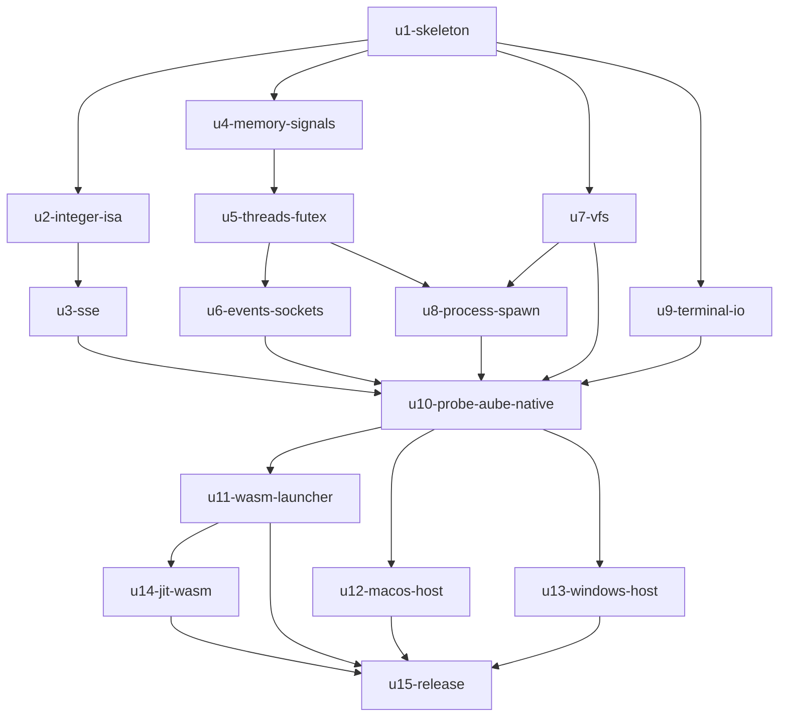

# Unit の依存関係：Rust 版 blink（paludarium）

上流の成果物：`inception/domain-design/components.md`（部品の依存）、`unit-of-work.md`（Unit の定義）。

この文書は依存関係（トポロジー）だけを決めます。作る順番や重要な経路は、Delivery Planning で決めます。

## 依存関係（機械向け）

```yaml
units:
  - name: u1-skeleton
    kind: library
    depends_on: []
  - name: u2-integer-isa
    kind: library
    depends_on: [u1-skeleton]
  - name: u3-sse
    kind: library
    depends_on: [u2-integer-isa]
  - name: u4-memory-signals
    kind: library
    depends_on: [u1-skeleton]
  - name: u5-threads-futex
    kind: library
    depends_on: [u4-memory-signals]
  - name: u6-events-sockets
    kind: library
    depends_on: [u5-threads-futex]
  - name: u7-vfs
    kind: library
    depends_on: [u1-skeleton]
  - name: u8-process-spawn
    kind: library
    depends_on: [u5-threads-futex, u7-vfs]
  - name: u9-terminal-io
    kind: library
    depends_on: [u1-skeleton]
  - name: u10-probe-aube-native
    kind: packaging
    depends_on: [u3-sse, u6-events-sockets, u7-vfs, u8-process-spawn, u9-terminal-io]
  - name: u11-wasm-launcher
    kind: library
    depends_on: [u10-probe-aube-native]
  - name: u12-macos-host
    kind: library
    depends_on: [u10-probe-aube-native]
  - name: u13-windows-host
    kind: library
    depends_on: [u10-probe-aube-native]
  - name: u14-jit-wasm
    kind: library
    depends_on: [u11-wasm-launcher]
  - name: u15-release
    kind: packaging
    depends_on: [u11-wasm-launcher, u12-macos-host, u13-windows-host, u14-jit-wasm]
```

## 図



矢印は「先に要る」向きです（`u1-skeleton --> u2-integer-isa` は、u2 が u1 に依存するという意味）。循環はありません。

## 細い一本

- 依存の順で最初になる Unit は u1-skeleton で、これが細い一本です。
- u1 は、ほかの Unit がなくても単独で動きます。ネイティブの Linux で hello world を最初から最後まで動かすのに必要な最小限を、すべての層にわたって含めているためです。
- 後の Unit は、u1 が作ったクレートに機能を足していきます。

## つなぎ目

| つなぎ目 | 関わる Unit | 内容 |
|----------|-------------|------|
| Host の trait | u1 が作り、u5・u9・u11・u12・u13 が足す | スレッド、待機と起床、時刻、標準入出力、端末、ホストのファイル（ADR-007） |
| Cpu が止まった理由（ExitReason） | u1 が作り、u2・u3・u14 が使う | 実行ループが Kernel に渡す（ADR-004） |
| syscall の振り分け表 | u1 が作り、u4〜u9 が足す | 未実装の syscall には ENOSYS を返す（FR2.1） |
| Vfs の API | u1 が最小限を作り、u7 が広げる | パスの解決、ファイルの操作 |
| 差分テストの仕組み | u1 が作り、すべての Unit が使う | ネイティブの x86-64 Linux との比較（FR9.1） |
| Launcher（JS）と wasm モジュールの境界 | u11 が作り、u14 が使う | formicarium との境界でもある（制約 C-T5） |

## 並行して作れる組み合わせ

- u1 の後：u2・u4・u7・u9 は、互いに依存しない。
- u2 の後の u3 と、u4 の後の u5 も、互いに依存しない。
- u10 の後：u11・u12・u13 は、互いに依存しない。
- 依存の順を守った並べ方は複数ある。どれを選ぶかは Delivery Planning で決める。
